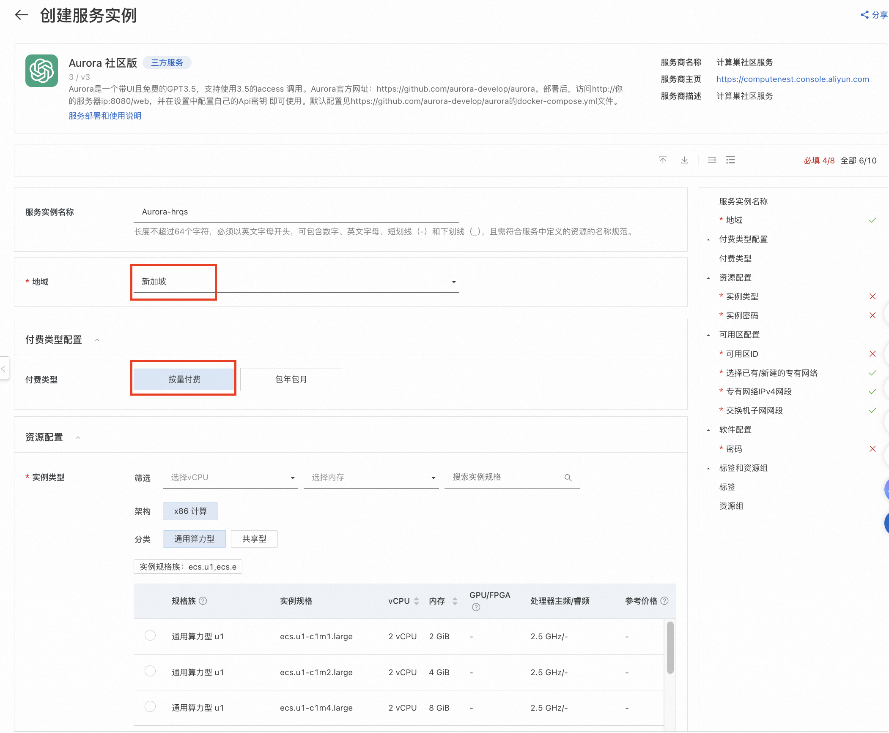
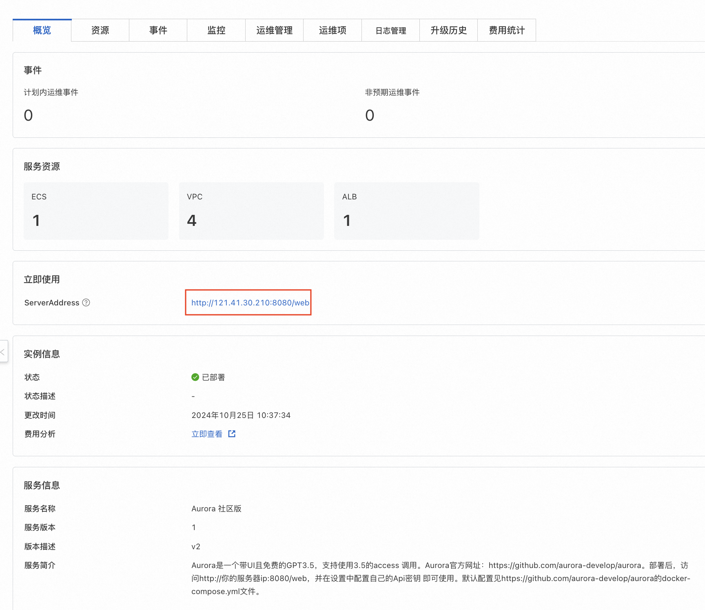

<h1> Rapid deployment of the Aurora compute nest </h1>

<blockquote>

<strong> Disclaimer:</strong> This service is provided by a third party. We try our best to ensure its security, accuracy and reliability, but we cannot guarantee that it is completely free from failure, interruption, error or attack. Therefore, the company hereby declares that it makes no representations, warranties or commitments regarding the content, accuracy, completeness, reliability, suitability and timeliness of the Service and is not liable for any direct or indirect loss or damage arising from your use of the Service; for third-party websites, applications, products and services that you access through the Service, do not assume any responsibility for its content, accuracy, completeness, reliability, applicability and timeliness, and you shall bear the risks and responsibilities of the consequences of use; for any loss or damage arising from your use of this service, including but not limited to direct loss, indirect loss, loss of profits, loss of goodwill, loss of data or other economic losses, even if we have been advised in advance of the possibility of such loss or damage; we reserve the right to amend this statement from time to time, so please check this statement regularly before using the Service. If you have any questions or concerns about this Statement or the Service, please contact us. 

</blockquote>

<h2> Overview </h2>

ChatGPT is an artificial intelligence technology-driven language model application launched by OpenAI, an American artificial intelligence research laboratory, on November 30, 2022. Due to the international background of OpenAI, compared with many large domestic models, ChatGPT has advantages in processing English and cross-cultural information, and can better understand and generate content in different languages and cultural backgrounds. 

Aurora is a free GPT private chat assistant with UI. you can access GPT through Aurora under simple UI configuration to quickly build your own AI assistant. The dedicated AI assistant has the obvious advantages of unlimited flow, fast response speed, variety of models and convenient switching. Aurora Official Website: https://github.com/aurora-develop/aurora 。 

 ariyun computing nest has packaged Aurora as a SaaS application. you do not need to download codes or install complex dependencies, nor do you need to connect to a foreign VPN. you only need to fill in 5 parameters and wait for 5 minutes to quickly build a private chat assistant through the domestic network. 

<h2> Prerequisites </h2>

 To deploy Aurora Community Edition service instances, you need to access and create some Alibaba Cloud resources. Therefore, your account must contain permissions for the following resources.
<strong> Note </strong>: This permission is required only when your account is a RAM account. 

<table>
<thead>
<tr>
<th> Permission policy name </th>
<th> Remarks </th>
</tr>
</thead>
<tbody>
<tr>
<td>AliyunECSFullAccess</td>
<td> Permissions to manage ECS </td>
</tr>
<tr>
<td>AliyunVPCFullAccess</td>
<td> Permissions for managing VPC networks </td>
</tr>
<tr>
<td>AliyunROSFullAccess</td>
<td> Manage permissions for Resource Orchestration Services (ROS) </td>
</tr>
<tr>
<td>AliyunComputeNestUserFullAccess</td>
<td> Manage user-side permissions for the compute nest service (ComputeNest) </td>
</tr>
</tbody>
</table>

<h2> Billing instructions </h2>

 the cost of Aurora community edition deployment in computing nest mainly involves:

<ul>
<li> Selected vCPU and Memory Specifications </li>
<li> System disk type and capacity </li>
<li> Internet bandwidth </li>
</ul>

<h2> Deployment Architecture </h2>

<h2> Parameter description </h2>

<table>
<thead>
<tr>
<th> Parameter group </th>
<th> Parameter item </th>
<th> Description </th>
</tr>
</thead>
<tbody>
<tr>
<td> Service instance </td>
<td> Service instance name </td>
<td> It must be no more than 64 characters in length and must start with an English letter. It can contain numbers, English letters, dashes (-), and underscores (_). </td>
</tr>
<tr>
<td></td>
<td> Region </td>
<td> Region where the service instance is deployed </td>
</tr>
<tr>
<td></td>
<td> Payment type </td>
<td> Resource billing type: Pay-As-You-Go and Subscription </td>
</tr>
<tr>
<td>ECS instance configuration </td>
<td> Instance type </td>
<td> Instance specifications available in the zone </td>
</tr>
<tr>
<td></td>
<td> Instance password </td>
<td> is 8-30 in length and must contain three items (uppercase letters, lowercase letters, numbers, ()'~!@#$%^& *-+ =|{}[]:' <>,./special symbols)</td>
</tr>
<tr>
<td> Network configuration </td>
<td> Availability Zone </td>
<td> Zone where the ECS instance is located </td>
</tr>
<tr>
<td></td>
<td>VPC ID</td>
<td> VPC where resources are located </td>
</tr>
<tr>
<td></td>
<td> Switch ID</td>
<td> Switch where the resource is located </td>
</tr>
</tbody>
</table>

<h2> Deployment process </h2>

<ol>
<li>
 Visit Compute Nest Aurora Community Edition <a href = "https://computenest.console.aliyun.com/service/instance/create/default?type=user&ServiceName=Aurora%20%E7%A4%BE%E5%8C%BA%E7%89%88"> Deployment link </a>
and fill in the deployment parameters as prompted. Among them, the region is Singapore (the domestic region cannot access the GPT model), the payment type is Pay-As-You-Go, the available zone configuration is any available zone ID and the new VPC, and the other parts can keep the default values.

</li>
<li>
 Complete the parameters. After confirming the parameters, click <strong> Next: Confirm Order </strong>.

</li>
<li>
 agree to the service agreement after confirming the order, you can see the inquiry details, click <strong> create now </strong>
Enter the deployment phase.

</li>
<li>
 After the submission is successful, click <strong> Go to List View </strong>. Wait for the deployment to be completed, which is expected to take about 5 minutes.

</li>
<li>
 After the deployment is completed, you can start using the service. Click the ServiceAddress link to enter the service instance details.

</li>
<li>
 Configure your own OpenAI API key to start a conversation with your GPT private chat assistant.

</li>
<li>
 in the upper right corner, you can select the GPT version to use, support switching GPT-3.5,4,4o and other commonly used versions, and support customizing key settings such as character, answer quality, reply speed and whether to allow long replies.

</li>
<li>
 Starting with Aurora

</li>
</ol>
